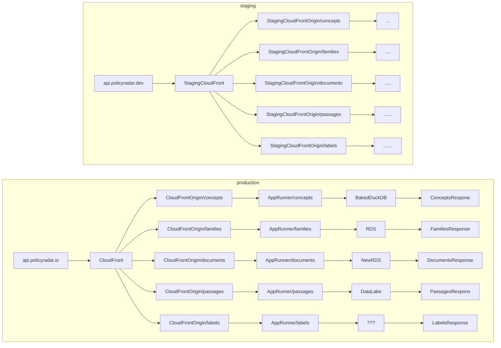

# Concepts API

## Prerequisites

- Python 3.12 or higher
- uv (Python package manager)
- Docker and Docker Compose
- AWS CLI configured with appropriate credentials
- `just` command runner

## Local Development Setup

1. **Install uv Dependencies**

   ```bash
   uv sync
   ```

2. **Bootstrap Initial Data**

   ```bash
   just bootstrap $environment
   ```

   This will download the latest concept data from S3 and create the DuckDB
   database. The `environment` argument should be something like `production`.
   You can optionally specify an AWS profile too with the `profile` argument.

3. **Start Development Server**

   ```bash
   just dev
   ```

   This will:

   - Sync latest data from staging environment
   - Start the service using Docker Compose
   - Enable hot-reload for code changes

For rebuilding after requirements changes:

```bash
just dev-rebuild
```

## Local Deployment to AWS App Runner

To deploy the service locally to App Runner (without GitHub):

1. **Update Requirements**

   ```bash
   just requirements
   ```

2. **Deploy to App Runner**

   ```bash
   just deploy-local [tag] [environment]
   ```

   Example:

   ```bash
   just deploy-local latest staging
   ```

   This command will:

   - Log into ECR
   - Build the Docker image
   - Push to ECR
   - Deploy to App Runner

## Architecture



## Known Issues and Gotchas

1. **ECR Repository Setup**

   - The ECR repository must exist before deploying
   - Create ECR repo first
   - Run `just deploy`
   - Create remaining AWS infrastructure

2. **VPC Connector**

   - App Runner VPC connector must be created before stack deployment

3. **AWS Credentials**
   - Ensure your AWS CLI is configured with appropriate credentials
   - Required permissions: ECR, App Runner, S3 access

## Environment Variables

The service requires the following environment variables:

- AWS credentials (if deploying)
- Environment-specific configurations are handled via the deployment process

## Troubleshooting

If you encounter issues:

1. **Docker Build Failures**

   - Ensure Docker daemon is running
   - Check available disk space
   - Verify AWS credentials

2. **Data Sync Issues**

   - Verify AWS credentials and S3 access
   - Check network connectivity
   - Ensure sufficient disk space for data

3. **Development Server Issues**
   - Check port conflicts
   - Verify Python version
   - Ensure all dependencies are installed

## TODO

[Linear project](https://linear.app/climate-policy-radar/project/isolate-services-within-navigator-backend-abeb5f150aa4/issues)

## Potential datalake-game

TBD
