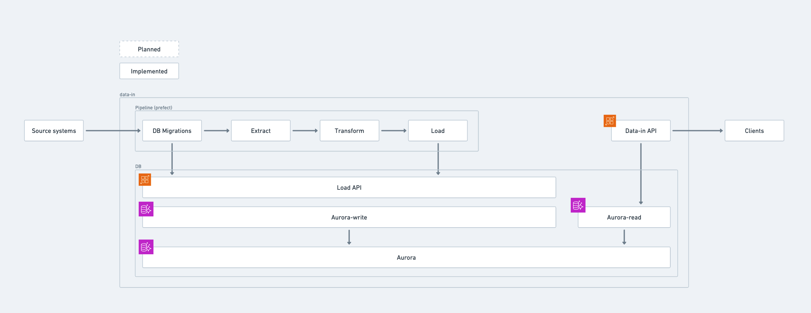

# Documents pipline

## Architecture diagram [DRAFT]

Source:
[Whimsical board (🔒)](https://whimsical.com/data-in-pipeline-architecture-diagram-XRAimnimFLPHy7Ysx5ejYD)

## Notes

- The Prefect `AWS_ENV` is always `prod` for `staging` and `production` Pulumi
  stacks
