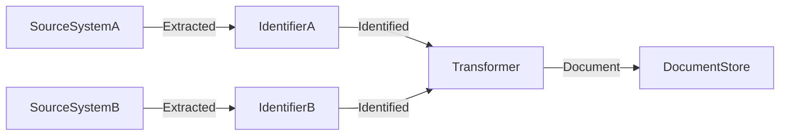

# Documents pipline

## Architecture diagram [DRAFT]

```mermaid

flowchart LR
    SourceSystemA -- Extracted --> IdentifierA -- Identified --> Transformer -- Document --> DocumentStore
    SourceSystemB -- Extracted --> IdentifierB -- Identified --> Transformer

```

## Notes

- The Prefect `AWS_ENV` is always `prod` for `staging` and `production` Pulumi
  stacks
