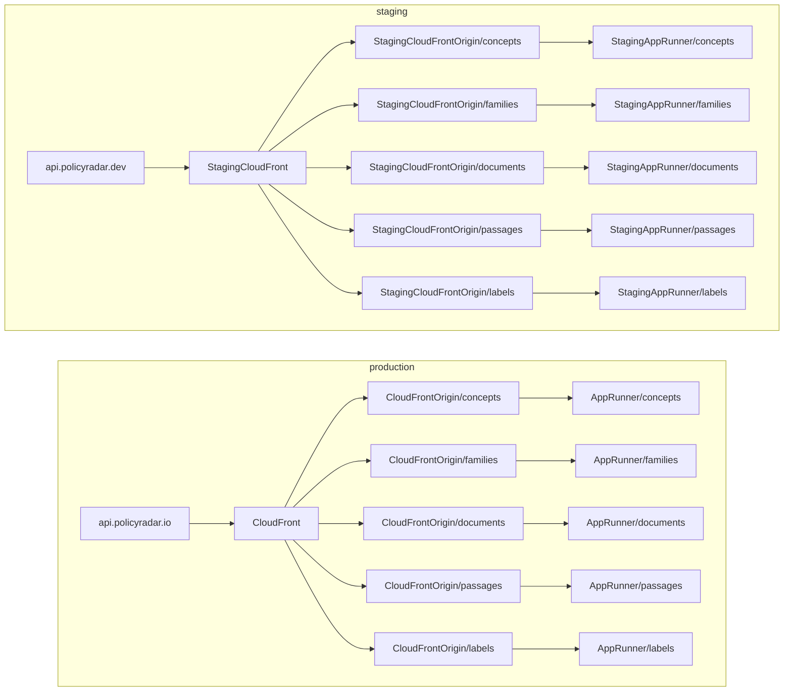

# families-api

## Decisions checklist

### Local development

**`just dev`**

- [x] To run the service locally, you should run `just dev`
- [x] We use docker compose to start up local services
- [x] For python code, we should also be able to run the framework's (FastAPI) native dev environment (`fastapi dev app/main.py`)
- [x] Data for seeing the service locally should be pre-loaded and prod-like
- [x] Any changes to code should be reflected immediately in the running service, no reloads needed

**`just test`**

- [ ] All tests should run when running `just test`
- [ ] Testing should be stateless and predictable at every run
- [ ] Tests should run the same locally and in CI
- [ ] Local tests should run on a watch

**`just build`**

**`just deploy`**

- [ ] the `main` branch will always be what's on production

**infra**

```bash
cd infra
pulumi up --stack production
```

## TODO

### Python App

**these can / shoudl be added when we have another service in to ensure we get the right abstraction**

- [ ] JSON logging
- [ ] OTel implementation

## POtential end-game


