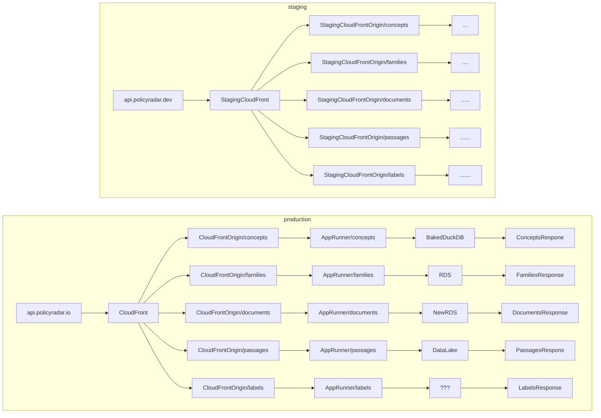

# families-api

## Local development

**`just dev`**

- To run the service locally, run `just dev`
- We use docker compose to start up local services
- We are able to run the framework's (FastAPI) native dev environment
  (`fastapi dev app/main.py`)
- Local data for the service is pre-loaded and prod-like
- Any changes to code are reflected immediately in the running service. No
  reloads needed

**`just build`**

TBD

**`just test`**

TBD

**`just deploy`**

TBD

## infra

```bash
cd infra
pulumi up --stack production
```

## TODO

[Linear project](https://linear.app/climate-policy-radar/project/isolate-services-within-navigator-backend-abeb5f150aa4/issues)

## Architecture di



## Potential datalake-game

TBD
