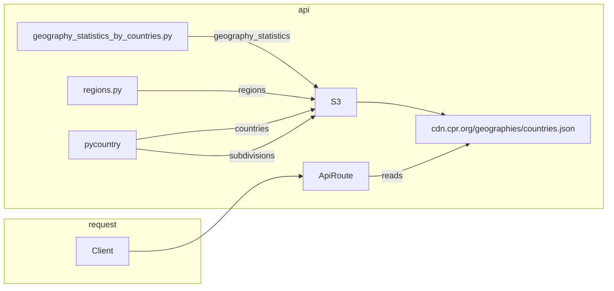

# geographies-api

## Development

[Please see the root README for instruction as this is managed at as a monorepo](../README.md).

## Architecture

TL;DR;

- We generate the data from multiple sources
- This data is colated into a JSON object
- The JSON object is stored in S3
- [This is made available via our CDN URL](https://cdn.climatepolicyradar.org/geographies/countries.json)
- When a request is made we use requests to lookup this JSON and get the relevant data

