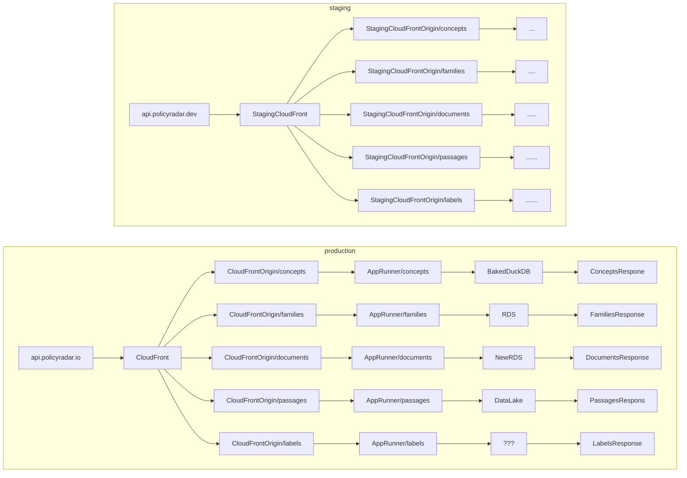

# geographies-api

## Local development

**`just local`**

- To run the service fully locally, run `just local`
- We use docker compose to start up local services, including localstack to mock
  AWS services like S3 (you can use the `awscli` tool to inspect and interact
  with localstack from your terminal)
- We are able to run the framework's (FastAPI) native dev environment
  (`fastapi dev app/main.py`)
- Local data for the service is pre-loaded and prod-like
- Any changes to code are reflected immediately in the running service.
  No reloads needed

## AWS Access for Local Development

The local containers are configured to pass AWS credentials from your host machine
to enable testing of endpoints that access data via the CPR CDN.

To use these features locally, you'll need to run the `just dev` command with AWS
credentials set up.

This setup allows you to test the geographies endpoint locally, which requires
AWS access to retrieve data from the CPR CDN.

**`just build`**

TBD

**`just test`**

TBD

**`just deploy`**

TBD

**`just deploy-local`**

```bash
just deploy-local [tag] [environment]
```

Example:

```bash
just deploy-local latest staging
```

This command will:

- Log into ECR
- Build the Docker image
- Push to ECR
- Deploy to App Runner

## infra

```bash
cd infra
pulumi up --stack production
```

## TODO

[Linear project](https://linear.app/climate-policy-radar/project/isolate-services-within-navigator-backend-abeb5f150aa4/issues)

## Architecture di



## Potential datalake-game

TBD

## GOTCHAS

- needing to create the ecr-repo and have a image to
  deploy before spinning up a whole stack i.e.
  - create ecr repo
  - just deploy
  - create rest of AWS stack
- needing the app runner vpc connector to be created before the stack is spun up
- renaming from families-api to geographies-api is a little cumbersome
